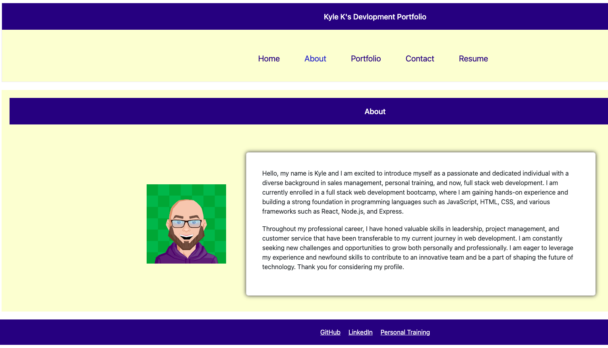

# Single-page Application Portfolio for a Web Developer
This is a single-page application portfolio for a web developer that showcases their skills, projects, and contact information. It is designed to provide a smooth user experience, with easy navigation and clear sections.
## Functionality
### Header
The header contains the developer's name and navigation titles corresponding to different sections of the portfolio.
### Navigation titles
The navigation titles include Home, About Me, Portfolio, Contact, and Resume, and the title corresponding to the current section is highlighted.
Clicking on a navigation title displays the corresponding section below the navigation without reloading the page, and the title is highlighted.
## Sections
The portfolio contains a header, a section for content, and a footer.
### About Me 
The About Me section displays an avatar of the developer and a short bio about them.
### Portfolio
The Portfolio section displays titled images of six of the developer’s applications with links to both the deployed applications and the corresponding GitHub repositories.
### Contact
The Contact section displays a contact form with fields for a name, an email address, and a message.
If a user exits out of a form field without entering text, they receive a notification that the field is required.
If a user enters an invalid email address, they receive a notification.
### Resume 
The resume section displays a link to a downloadable resume and a list of the developer’s proficiencies.
### Footer
The footer displays text links to the developer’s GitHub and LinkedIn profiles, as well as their profile on a third platform.
## Technologies Used
HTML
CSS
JavaScript
React
## Mock up

## Links
### Github Repo
https://github.com/KyleKarotko/devportfolio
### Deployed application link
https://kylekarotko.github.io/devportfolio
## Credits
This portfolio was created by Kyle Karotko.
